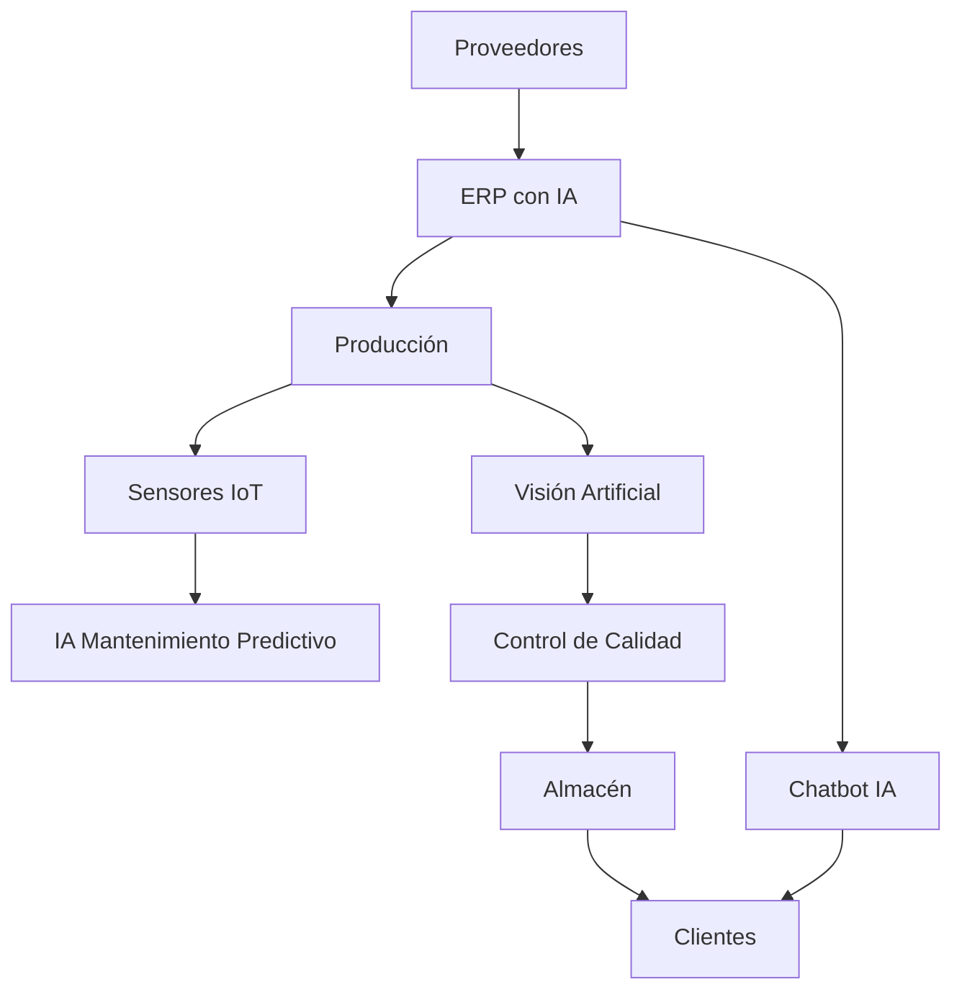

# Diagrama de transformación digital

```mermaid
flowchart TD

A[Proveedores]

A --> B[ERP con IA]

B --> C[Producción]

C --> D[Sensores IoT]

D --> E[IA Mantenimiento Predictivo]

C --> F[Visión Artificial]

F --> G[Control de Calidad]

G --> H[Almacén]

H --> I[Clientes]

B --> J[Chatbot IA]

J --> I
```